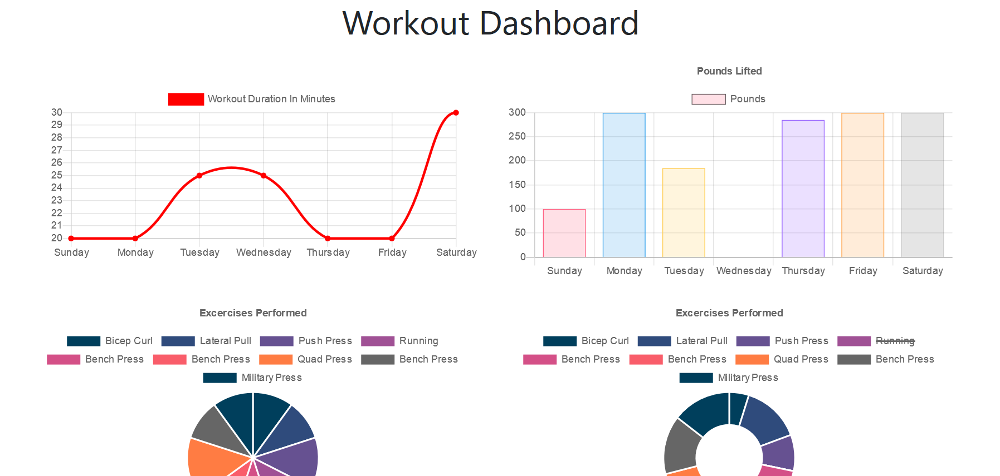

# WorkoutTracker

## Description
This application allows the user to create a workout for the day. The user can add exercises to that workout and see the total stats for the week. The exercises have different fields such as: type, duration, weight, sets, reps, and distance. These fileds are saved to a database using mongoose and connected to a mongo atlas database.

## Challenges 
Getting the mongoose schemas to connect with the API routes was a challenge. I had to make sure all of the routes were working properly. It helped being able to use roboTree to see if the data was being stored properly It's important to make sure the database is structured to work locally and then when deployed.

## Usage instructions

The app is deployed in heroku at the link below.

https://workouttracker-rsm.herokuapp.com/

Here is a screenshoot of a saved workout

Here is an example screenshot for the stats of the week

## License

MIT 

Copyright 2020 Raunel Suarez-Magana

Permission is hereby granted, free of charge, to any person obtaining a copy of this software and associated documentation files (the "Software"), to deal in the Software without restriction, including without limitation the rights to use, copy, modify, merge, publish, distribute, sublicense, and/or sell copies of the Software, and to permit persons to whom the Software is furnished to do so, subject to the following conditions:

The above copyright notice and this permission notice shall be included in all copies or substantial portions of the Software.

THE SOFTWARE IS PROVIDED "AS IS", WITHOUT WARRANTY OF ANY KIND, EXPRESS OR IMPLIED, INCLUDING BUT NOT LIMITED TO THE WARRANTIES OF MERCHANTABILITY, FITNESS FOR A PARTICULAR PURPOSE AND NONINFRINGEMENT. IN NO EVENT SHALL THE AUTHORS OR COPYRIGHT HOLDERS BE LIABLE FOR ANY CLAIM, DAMAGES OR OTHER LIABILITY, WHETHER IN AN ACTION OF CONTRACT, TORT OR OTHERWISE, ARISING FROM, OUT OF OR IN CONNECTION WITH THE SOFTWARE OR THE USE OR OTHER DEALINGS IN THE SOFTWARE.